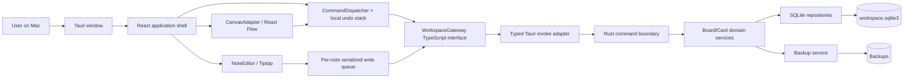

# Visual Workspace V1 Implementation Plan

**Goal:** Build a local-first macOS application whose root screen and every nested board are Milanote-like infinite canvases containing only rich-text notes and child-board portals.

**Architecture:** Use a Tauri 2 shell with a React UI, React Flow behind an application-owned canvas adapter, and a Rust domain/persistence layer backed by SQLite. The frontend owns ephemeral interaction state; every durable mutation crosses a typed workspace gateway and is committed transactionally in Rust.

**Tech Stack:** Tauri 2, Rust, React 19, TypeScript, Vite, `@xyflow/react`, Tiptap 3 open-source packages, SQLite through `rusqlite`, Vitest, React Testing Library, Playwright for browser-mode UI flows, Rust integration tests.

**Status:** DRAFT for user review

**Reference screens:**

- `/Users/bro/Screenshots/CleanShot 2026-08-27 at 10.45.14@2x.png`
- `/Users/bro/Screenshots/CleanShot 2026-08-27 at 10.47.56@2x.png`

---

## Product Thesis

This is not a dashboard, file explorer, graph editor, or generic second brain. It is a spatial project surface.

`Home` is itself a board. A user places notes and child-board portals anywhere on it. Opening a portal replaces the current canvas with the child board while preserving hierarchy through breadcrumbs and back navigation. Every board remembers its own layout and viewport.

The first release must answer one question: **is it more comfortable to think and organize daily work through nested spatial boards than through folders and linear documents?**

### V1 scope

- Infinite two-dimensional canvas with a quiet dotted background.
- Note cards with inline rich-text editing.
- Board portal cards that open child boards.
- Unlimited logical nesting, with cycle prevention.
- Breadcrumb and browser-style back/forward navigation.
- Pan, pinch zoom, drag, width resize, selection, multi-selection, delete, and note duplication.
- Per-board viewport persistence.
- Autosave and crash-safe SQLite transactions.
- Session undo/redo for canvas operations; editor-local undo/redo for text.
- Soft-delete Trash and local database backups.
- One local user, one visible workspace, and one window. The schema retains a workspace namespace so future import/export can create an isolated staging workspace without changing every foreign key; V1 exposes no workspace switcher.
- V1 bootstraps exactly one workspace ID into Rust application state. Every command is pinned to that ID, and no V1 command or migration path may create a second workspace row after first-run initialization.

### Core Prototype versus V1 hardening

- **Core Prototype, Slices 0–4:** durable Home, useful notes, natural Canvas, nested Boards, breadcrumbs, and exact reopen. This is the first product-learning checkpoint.
- **V1 hardening, Slice 5:** undo/redo, soft delete with immediate recovery, and visible save failures.
- **V1.1 safety backlog, Slice 6:** polished backup recovery, measured large-board budgets, and release packaging. These do not block testing whether the spatial product is useful.

Clipboard semantics are intentionally narrow: normal macOS text copy/paste works while the editor owns focus. Canvas-level card copy/paste is deferred; V1 provides an explicit Duplicate command for selected notes only.

Pointer and selection semantics are fixed for V1:

- Pointer down selects the card. If the pointer is released without crossing a 4 CSS px movement threshold, a Note immediately enters editing at the clicked text position.
- If the pressed pointer crosses 4 CSS px before release, the same gesture becomes a card drag and does not enter editing. No double click or dedicated drag handle is required.
- `Shift+click` toggles cards in the current selection without entering Note editing or opening a Board.
- Dragging empty Canvas creates a partial-intersection marquee selection.
- `Cmd+A` selects all cards only when Canvas owns focus; inside the editor it selects text.
- Notes and Board Portals may be moved together.
- Entering Note edit mode makes that Note the sole selected card. While already editing, pointer gestures inside text select text; moving the card starts from its outer padding/frame. `Escape` exits editing and leaves it selected.
- Delete on a mixed selection soft-deletes Notes and treats every selected Board Portal as an explicit Board-deletion request, with one confirmation showing how many Board subtrees are affected.

### Explicit non-goals

- Files, folders, images, link previews, filesystem shortcuts, or external mounts.
- LLM integration, agents, tool calling, or generated content.
- Cloud sync, collaboration, accounts, authentication, sharing, or web access.
- Tags, status, tables, gallery views, global search, tasks, columns, drawing, arrows, or comments.
- Public plugin SDK or user-installable card types.
- Duplicate Board and Board Shortcut. V1 can duplicate notes; board copying is deferred because ownership and deep-copy semantics must be designed separately.
- Mac App Store distribution. V1 is a local development build, followed by a signed/notarized direct download when distribution matters.

---

## A. Architecture Decision Record

### ADR-001: Tauri 2 with a web-rendered canvas

**Decision:** Use Tauri 2, React, and TypeScript for the application shell and UI.

**Why:** The product requires a highly interactive spatial surface and may later gain a web client. Tauri supplies a macOS application shell and typed command boundary without shipping a browser runtime. Its official architecture explicitly combines Rust tooling with HTML rendered in the OS WebView.

**Consequences:**

- UI logic remains portable to a future web shell.
- Mac-specific behavior is exposed through narrow Rust commands, not imported throughout React components.
- Trackpad behavior must be tested on real macOS hardware early.
- The app must use a strict Tauri capability configuration even before filesystem features exist.

### ADR-002: React Flow behind `CanvasAdapter`

**Decision:** Use `@xyflow/react` for viewport, selection, node dragging, resizing, and background rendering, but isolate all library-specific types behind `src/canvas/CanvasAdapter.tsx` and `src/canvas/canvas-types.ts`.

**Why:** React Flow already exposes controlled viewport state, custom nodes, partial selection, scroll panning, pinch zoom, and a background grid. Those are the expensive interaction primitives V1 needs.

**Consequences:**

- No React Flow `Node` type may enter domain, command, persistence, or repository modules.
- Edges and connection handles are disabled. This is a spatial board, not a graph.
- A renderer replacement remains possible if real profiling later proves React Flow insufficient.

### ADR-003: SQLite is authoritative; React state is a projection

**Decision:** Store boards, cards, note documents, viewports, revisions, and Trash state in SQLite. Use the frontend store as an optimistic projection of the currently open board only.

**Why:** A local personal knowledge tool must reopen exactly where it was left and survive application crashes. UI state alone cannot be authoritative.

**Consequences:**

- All mutations are durable Rust commands executed in transactions.
- Frontend writes are serialized per entity so debounced note writes cannot arrive out of order.
- WAL mode is allowed, but backups use SQLite's backup API and never copy only the main database while a live WAL may contain committed data.

### ADR-004: Board hierarchy is separate from canvas placement

**Decision:** A board has one logical `parent_board_id`; its portal card has placement on the parent canvas. They are related but separate records.

**Why:** Hierarchy answers “where does this board belong?” while the card answers “where is its portal drawn?” Keeping them separate avoids coupling domain ownership to renderer geometry and leaves room for future Board Shortcuts.

### ADR-005: Two undo domains in V1

**Decision:** Canvas and board operations use an application command stack. Text editing uses Tiptap's editor history while a note is focused.

**Why:** One cross-editor undo timeline would require durable operation transformation or a unified document model. That is an ocean for V1. The split is understandable: `Cmd+Z` edits text while typing and reverts spatial actions while the canvas owns focus.

**Later:** A persisted workspace-wide operation log can unify histories if observed usage proves the split confusing.

### ADR-006: Soft delete before physical cleanup

**Decision:** Deletion assigns a `trash_batch_id` and `deleted_at`; it does not physically remove rows in normal V1 use.

**Why:** The most expensive bug in this product is lost user thought. Storage is tiny while V1 contains only notes and metadata.

### Ecosystem snapshot checked on 2026-08-28

| Component | Checked version | License | Decision |
|---|---:|---|---|
| `@tauri-apps/cli` | 2.11.4 | Apache-2.0 OR MIT | Use Tauri 2 |
| `@xyflow/react` | 12.11.5 | MIT | Use behind adapter |
| `@tiptap/react` | 3.30.5 | MIT | Use open-source editor packages only |
| React | 19.2.8 | MIT | Use current scaffold default |
| Vite | 8.2.2 | MIT | Use current scaffold default |
| SQLite | system/bundled through Rust crate | Public domain | Use migrations and WAL |

Exact versions must be written into the lockfiles when scaffolding. Do not use Tiptap Pro, Cloud, Comments, AI, or Version History packages in V1.

Version and license fields were checked through each package's official npm registry `latest` document on 2026-08-28, then capabilities and behavior were checked against the official project documentation linked below. Treat the lockfiles created during scaffolding, not this planning snapshot, as the build's source of truth.

Official references:

- Tauri architecture: https://v2.tauri.app/concept/architecture/
- Tauri capabilities: https://v2.tauri.app/security/capabilities/
- Tauri commands: https://v2.tauri.app/develop/calling-rust/
- React Flow viewport behavior: https://reactflow.dev/learn/concepts/the-viewport
- React Flow component API: https://reactflow.dev/api-reference/react-flow
- Tiptap React setup: https://tiptap.dev/docs/editor/getting-started/install/react
- Tiptap open-source licensing: https://tiptap.dev/docs/editor/getting-started/overview
- SQLite WAL: https://www.sqlite.org/wal.html
- SQLite transactions: https://www.sqlite.org/lang_transaction.html

---

## B. System Diagram



### Runtime ownership

| State | Owner | Persistence timing |
|---|---|---|
| Pointer position, marquee, active resize | React Flow | Never |
| Selected cards | Frontend store | Session only |
| Current navigation history | Frontend router/store | Session only |
| Card geometry | SQLite | Drag/resize end |
| Note document | SQLite | 250 ms debounce, blur, navigation, close |
| Board title and hierarchy | SQLite | Immediate transaction |
| Viewport | SQLite | 400 ms trailing debounce and navigation |
| Undo stacks | Frontend/Tiptap | Session only |
| Trash | SQLite | Immediate transaction |

---

## C. Data Model

All IDs are application-generated UUIDv7 strings. Times are UTC Unix milliseconds. Every durable mutable entity carries an integer `revision` for ordered writes and future sync conflict detection.

```sql
PRAGMA foreign_keys = ON;
PRAGMA journal_mode = WAL;
PRAGMA synchronous = FULL;
PRAGMA busy_timeout = 5000;

CREATE TABLE workspaces (
    id TEXT PRIMARY KEY,
    title TEXT NOT NULL,
    root_board_id TEXT NOT NULL UNIQUE,
    created_at INTEGER NOT NULL,
    updated_at INTEGER NOT NULL
);

CREATE TABLE boards (
    id TEXT PRIMARY KEY,
    workspace_id TEXT NOT NULL REFERENCES workspaces(id),
    parent_board_id TEXT REFERENCES boards(id),
    title TEXT NOT NULL CHECK(length(trim(title)) BETWEEN 1 AND 200),
    color_token TEXT NOT NULL,
    symbol TEXT,
    revision INTEGER NOT NULL DEFAULT 1,
    created_at INTEGER NOT NULL,
    updated_at INTEGER NOT NULL,
    deleted_at INTEGER,
    trash_batch_id TEXT,
    CHECK(parent_board_id IS NULL OR parent_board_id <> id)
);

CREATE TABLE cards (
    id TEXT PRIMARY KEY,
    board_id TEXT NOT NULL REFERENCES boards(id),
    kind TEXT NOT NULL CHECK(kind IN ('note', 'board_portal')),
    x REAL NOT NULL,
    y REAL NOT NULL,
    width REAL NOT NULL CHECK(width >= 120 AND width <= 1600),
    height REAL NOT NULL CHECK(height >= 48 AND height <= 10000),
    z_index INTEGER NOT NULL DEFAULT 0,
    revision INTEGER NOT NULL DEFAULT 1,
    created_at INTEGER NOT NULL,
    updated_at INTEGER NOT NULL,
    deleted_at INTEGER,
    trash_batch_id TEXT
);

CREATE TABLE note_cards (
    card_id TEXT PRIMARY KEY REFERENCES cards(id),
    document_json TEXT NOT NULL,
    plain_text TEXT NOT NULL DEFAULT ''
);

CREATE TABLE board_portal_cards (
    card_id TEXT PRIMARY KEY REFERENCES cards(id),
    target_board_id TEXT NOT NULL UNIQUE REFERENCES boards(id)
);

CREATE TABLE board_view_states (
    board_id TEXT PRIMARY KEY REFERENCES boards(id),
    viewport_x REAL NOT NULL DEFAULT 0,
    viewport_y REAL NOT NULL DEFAULT 0,
    zoom REAL NOT NULL DEFAULT 1 CHECK(zoom BETWEEN 0.1 AND 4),
    revision INTEGER NOT NULL DEFAULT 1,
    updated_at INTEGER NOT NULL
);

CREATE INDEX idx_boards_parent_active
    ON boards(parent_board_id, deleted_at);
CREATE INDEX idx_cards_board_active
    ON cards(board_id, deleted_at, z_index);
CREATE INDEX idx_cards_trash_batch
    ON cards(trash_batch_id);
CREATE INDEX idx_boards_trash_batch
    ON boards(trash_batch_id);
```

### Invariants enforced by the domain service

1. Every workspace has exactly one undeletable root board.
2. V1 application state contains exactly one bootstrapped workspace ID; repositories reject access to any other workspace and expose no workspace-creation command.
3. Every non-root board has exactly one primary portal card on its parent board.
4. A portal target must be the direct child of the card's containing board.
5. Reparenting cannot make a board its own ancestor. Reparenting is not exposed in V1 UI.
6. `note_cards` can only belong to a card whose kind is `note`.
7. `board_portal_cards` can only belong to a card whose kind is `board_portal`.
8. Deleting a board portal moves the target board and its complete descendant subtree to the same Trash batch.
9. Restoring a Trash batch restores the original hierarchy and placement atomically.
10. Root board deletion always returns a domain error.
11. A mutation with a stale `expected_revision` is rejected rather than silently overwriting newer state.

---

## D. Filesystem Layout

V1 stores no user assets. The application support directory contains only metadata, logs, and safe snapshots.

```text
~/Library/Application Support/VisualWorkspace/
├── workspace.sqlite3
├── workspace.sqlite3-wal       # present while WAL has frames
├── workspace.sqlite3-shm       # present while connections use WAL
├── backups/
│   ├── workspace-2026-08-28T060000Z.sqlite3
│   └── manifest.json
└── logs/
    └── visual-workspace.log
```

Rules:

- Resolve this directory through the Tauri application-data API. Never hardcode the user's home path.
- Never expose arbitrary database paths to the frontend.
- Never back up by copying `workspace.sqlite3` alone while a connection is open in WAL mode.
- Keep the newest 10 verified snapshots. Pruning begins only after a new snapshot passes `PRAGMA integrity_check`.
- Future `assets/` and external bookmark storage are reserved concepts, not empty V1 directories.

---

## E. Card Architecture

### Internal registry

```ts
export type CardKind = 'note' | 'board_portal'

export interface CanvasCard {
  id: string
  boardId: string
  kind: CardKind
  frame: { x: number; y: number; width: number; height: number }
  zIndex: number
  revision: number
}

export interface CardDefinition<TCard extends CanvasCard> {
  kind: TCard['kind']
  defaultSize: { width: number; height: number }
  render(card: TCard): React.ReactNode
  serialize(card: TCard): unknown
}
```

`CardRegistry` is internal composition, not a plugin SDK. It maps persisted domain card kinds to renderer components. It contains no filesystem, Tauri, SQL, or network behavior.

### Note card

- White paper-like surface with subtle shadow and 4–6 px radius.
- Width alone is manually resizable, from 180–800 CSS px. Height is never directly resized: it auto-grows from editor content, has a 72 px minimum, and is persisted so the first frame after reopen does not jump.
- Pointer release without drag immediately edits at the clicked text position; `Enter` also edits a keyboard-selected Note. Pointer movement beyond 4 CSS px drags the Note instead.
- Tiptap StarterKit subset: paragraph, heading levels 1–3, bold, italic, bullet list, ordered list, blockquote, undo/redo.
- Links and highlights are deferred unless they arrive effectively free through the chosen open-source extension set.
- Editor JSON is authoritative content; `plain_text` is derived for future search.

### Board portal card

- Fixed 120 × 112 CSS px frame with a 60 px rounded-square tile, centered title, and muted child counts.
- Saturated muted color is identity, not status.
- Single click selects; drag moves; double click or `Enter` opens.
- Child counts are returned with the board snapshot and never computed through N+1 frontend calls.
- Custom uploaded cover images are deferred. V1 supports a small curated symbol set plus color.
- Creation defaults are `New Board`, a deterministic palette color selected from the new Board ID, and `symbol = NULL`. A null symbol always renders the first current-title grapheme, so rename needs no hidden “auto versus manual” state. A future explicit symbol picker stores a non-null symbol. Duplicate sibling titles are allowed.

---

## F. File Lifecycle

There are no user files in V1.

The only file lifecycle is the SQLite database and backups:

1. On first launch, create the application-data directory and database.
2. Run versioned migrations in one exclusive transaction.
3. Open with foreign keys, WAL, full synchronous writes, and a busy timeout.
4. In V1.1 hardening, create a consistent SQLite backup on the application idle/startup policy.
5. Validate the backup with `PRAGMA integrity_check` before retention pruning.
6. On database open failure, do not create a replacement over the same path. Core Prototype shows a blocking preservation error; V1.1 adds the guided recovery UI defined below.

Filesystem assets, linked folders, macOS bookmarks, Quick Look, and drag-out are postponed until the canvas product has proven useful.

---

## G. Board Lifecycle

### Create child board

```text
User selects Board tool and places portal
  -> frontend generates board_id, portal_card_id, command_id
  -> frontend dispatches CreateChildBoard(parent_board_id, ids, default title/icon/frame)
  -> Rust begins transaction
  -> create board + view state + primary portal card
  -> commit
  -> return complete BoardPortal DTO
  -> optimistic UI reconciles revisions
```

Failure leaves no partial board or portal. The frontend generates stable IDs before calling Rust. If the response is lost after commit, it reloads the parent snapshot; retrying the same command uses the same IDs, and the backend returns the already-created matching aggregate rather than creating another Board. A conflicting reuse of an ID is a domain error. This remains safe across an application crash without a permanent command-receipt table.

### Open board

1. Flush pending note and viewport writes for the current board.
2. Push current board ID onto navigation history.
3. Request a single `BoardSnapshot` containing board identity, breadcrumb ancestors, active cards, note documents, portal metadata/counts, and viewport.
4. Replace the canvas projection.
5. Restore the board's saved viewport without `fitView`.
6. Focus the canvas.

If the board was deleted in another command path, show a recoverable “Board is in Trash” state and offer Back, not a blank canvas.

### BoardSnapshot contract

```ts
export interface BoardSnapshot {
  board: {
    id: string
    title: string
    parentBoardId: string | null
    revision: number
  }
  breadcrumbs: Array<{ id: string; title: string }>// Home ... current Board
  viewport: { x: number; y: number; zoom: number; revision: number }
  cards: Array<
    | {
        kind: 'note'
        id: string
        boardId: string
        frame: { x: number; y: number; width: number; height: number }
        zIndex: number
        revision: number
        documentJson: unknown
        plainText: string
      }
    | {
        kind: 'board_portal'
        id: string
        boardId: string
        frame: { x: number; y: number; width: 120; height: 112 }
        zIndex: number
        revision: number
        target: {
          id: string
          title: string
          colorToken: string
          symbol: string | null // null means derive first grapheme from current title
          childBoardCount: number
          childCardCount: number
        }
      }
  >
}
```

### Rename board

Rename commits immediately. The current title, portal title, and breadcrumb all derive from the board record, so there is no duplicated title to reconcile.

### Delete board

Deleting the portal card creates one Trash batch. A recursive CTE finds the target board and descendants, then marks their boards, cards, and primary portals in one transaction. The root board cannot enter this flow.

### Restore board

Restore the entire Trash batch atomically. If the original parent is still in Trash, restore is blocked with an explanation or restores the required ancestor batch first; it never silently reparents to Home.

---

## H. Undo/Redo Architecture

### Canvas command contract

```ts
export interface WorkspaceCommand<TResult = void> {
  id: string
  label: string
  execute(gateway: WorkspaceGateway): Promise<TResult>
  undo(gateway: WorkspaceGateway): Promise<void>
  mergeWith?(next: WorkspaceCommand): WorkspaceCommand | null
}
```

Commands:

- `CreateNoteCommand`
- `MoveCardsCommand`
- `ResizeCardCommand`
- `DuplicateNotesCommand`
- `CreateChildBoardCommand`
- `RenameBoardCommand`
- `TrashSelectionCommand` (Notes plus explicit Board-deletion semantics for selected portals)
- `RestoreTrashBatchCommand`

Rules:

- Drag and resize update local positions continuously but persist once on gesture end.
- One gesture equals one undo entry.
- Multi-card movement is one transaction and one undo entry.
- A failed durable command rolls optimistic state back and never enters history.
- Undo dispatches a new durable inverse mutation; it does not merely change React state.
- Redo is cleared after any new command.
- Maximum 200 canvas commands per session.
- While a Tiptap editor owns focus, its history handles `Cmd+Z`/`Cmd+Shift+Z`. When focus returns to canvas, the workspace command stack handles them.
- Note-content saves do not enter the workspace command stack. Tiptap history remains valid while that editor instance is mounted; navigation flushes the current document, then unmounts it and ends that editor-local undo timeline.
- Duplicating a Note first flushes its pending editor write. If the flush fails, duplication is blocked with Retry/Copy Text rather than duplicating stale persisted content.
- If any flush fails before navigation or snapshot reload, navigation is blocked and the mounted Note remains editable with its dirty in-memory buffer intact. A persistent error banner offers Retry and Copy Text. The app never replaces that Note from a snapshot until the user explicitly chooses Discard Local Changes; discard requires confirmation and reloads the last persisted document. After process termination, only the last committed document is recoverable in V1.
- Undo history is intentionally not restored after application restart.

---

## I. Search Architecture

Global search is not part of V1.

Preparation that costs little now:

- Store derived `plain_text` beside Tiptap JSON.
- Keep stable card and board IDs.
- Keep search out of React components by reserving a future `SearchGateway` interface.

When search is added, create an FTS5 external-content index over active note text and board titles, update it transactionally, and rebuild it from authoritative tables if corruption is detected. Do not add FTS5 until a user-facing search slice is scheduled.

---

## J. Backup Strategy

This is a **V1.1 safety slice**, not a blocker for testing the Core Prototype.

### Product-visible behavior

- Settings > Data Safety shows the last successful backup time and `Create Backup Now`.
- If the database cannot be opened, the app shows a blocking Recovery screen. It never silently creates a replacement database at the same path.
- Recovery offers `Reveal Data Folder`, a list of validated snapshots, `Restore Selected Backup`, and `Quit`.
- Restore explains that the current database set will be preserved under a timestamped recovery folder before replacement.
- Success restarts into Home and reports the restored snapshot time. Failure keeps both source and snapshot untouched and exposes `Reveal Data Folder` plus a copyable diagnostic.

### Implementation constraints

- Create a backup after the first successful migration and at most once per 24 hours after subsequent launches.
- Use SQLite's online backup API through Rust.
- Run integrity check against the completed snapshot.
- Keep 10 valid snapshots; never prune when the new snapshot failed.
- Update `manifest.json` through write-to-new-file plus atomic rename; record schema version, creation time, source application version, file size, and validation result.
- Preserve the complete damaged database set before restore. Never separate a live main database from its WAL/SHM state.

---

## K. Sync-readiness

V1 does not contain a sync engine, event log, account, device identity, or network code.

The following inexpensive choices prevent a rewrite:

- Stable UUIDv7 IDs generated before persistence.
- Integer revisions and `updated_at` on mutable entities.
- Soft deletes with stable Trash batch IDs.
- Typed domain commands instead of arbitrary SQL from the UI.
- Board hierarchy independent of filesystem layout.
- Note content stored as a versionable structured document.
- Migration-controlled schema.

These choices are sync-ready, not sync architecture. Conflict resolution, CRDTs, operation logs, and server protocols are intentionally deferred until a second device is an actual requirement.

---

## L. macOS Integration Risks

| Risk | V1 mitigation | Gate |
|---|---|---|
| Trackpad scroll interpreted as zoom | Configure design-tool viewport: two-finger pan, pinch or `Cmd+scroll` zoom | Manual validation in the real Tauri WebView on a real trackpad; browser automation is not evidence for gesture feel |
| WebView text editor captures canvas shortcuts | Central focus arbiter and explicit Tiptap/canvas shortcut ownership | Automated focus tests + manual smoke |
| Click-to-edit conflicts with click-hold-drag | When a Note is not editing, pointer movement beyond 4 CSS px converts the press into drag; release below threshold edits. While already editing, text gestures select text and the outer frame moves the card. | Pointer-threshold component tests + usability test |
| Retina scaling blurs grid or text | CSS-pixel coordinates, transform testing at 1x/2x, avoid rasterized note surfaces | Screenshot test at 2x |
| Window close loses debounced content | Flush write queues on blur, board navigation, and close request | Delayed-write integration test |
| App crash leaves WAL files | Treat main DB, WAL, and SHM as one live database set; use SQLite recovery | Kill-process smoke test |
| React Flow default graph affordances leak through | Disable handles, edges, minimap, default controls, and connection behavior. During scaffolding, verify and apply the attribution configuration supported by the locked React Flow version. | Visual regression test |
| Deep breadcrumbs overflow | Collapse middle ancestors into an ellipsis menu while preserving Home and current board | Component test at depth 20 |

---

## Visual Interface Contract

> Detailed visual rules and the follow-up implementation sequence are now maintained in
> `.interface-design/system.md` and `docs/plans/2026-09-04-spatial-workspace-interface.md`.
> This section remains the high-level product contract.
> Link conversion, editable previews, and clipboard cover replacement are specified in
> `docs/specs/link-card-and-clipboard.md`.

### Intent

One person opens this between unrelated tasks and needs to recognize their own spatial memory immediately. The interface should feel like a large quiet desk covered with index cards and portals, not like project-management software.

### Domain

- Desk surface
- Index card
- Pinboard
- Spatial memory
- Portal/doorway
- Trail/breadcrumb
- Pile and neighborhood

### Color world

- Warm paper white for notes
- Fog gray for the canvas
- Graphite for primary text
- Pencil gray for metadata
- Terracotta, moss, muted sky, sand, and ink blue for board identity

### Signature

The Board Portal is the signature: a compact colored square or symbol that acts as a doorway into another complete spatial surface. It is the only consistently saturated object, so nested structure is visible without a folder tree.

### Defaults explicitly rejected

- Standard application sidebar -> narrow creation rail that does not represent hierarchy.
- Dashboard card grid -> free spatial canvas at every level, including Home.
- Folder tree -> Board Portals plus breadcrumbs.
- Floating bubble toolbars everywhere -> contextual controls only when an object or text range is selected.
- Heavy rounded SaaS cards -> paper rectangles with small radii and whisper-quiet shadows.

### Initial tokens

```css
:root {
  --desk: #f3f5f4;
  --desk-dot: rgba(74, 82, 78, 0.14);
  --paper: #fffefa;
  --paper-raised: #ffffff;
  --ink: #252927;
  --ink-secondary: #5f6763;
  --ink-tertiary: #929995;
  --ink-muted: #bdc2bf;
  --edge-soft: rgba(54, 63, 58, 0.08);
  --edge-focus: rgba(60, 108, 91, 0.52);
  --portal-terracotta: #c77b55;
  --portal-moss: #899b71;
  --portal-sky: #72a9c7;
  --portal-sand: #c3a66d;
  --portal-ink: #657482;
  --space-unit: 4px;
  --radius-note: 5px;
  --radius-portal: 12px;
  --shadow-paper: 0 1px 2px rgba(31, 37, 33, 0.08), 0 5px 16px rgba(31, 37, 33, 0.05);
}
```

Use the macOS system font stack in V1 because the target is a native-feeling personal Mac tool and no external font should delay first render. This is an intentional platform choice, not an unexamined browser default.

### Chrome

- Top bar: Home/breadcrumbs on the left, current board title centered when space permits, undo/redo on the right.
- Left rail: only Note and Board in V1, with tooltips and keyboard hints.
- Canvas: full remaining window, dotted grid, no permanent minimap or zoom widget.
- Selected objects: thin focus outline and restrained handles.
- Empty/loading/error states appear within the canvas without replacing spatial context.

### Fidelity target from reference screenshots

The app should preserve the reference's information hierarchy and interaction grammar, not copy Milanote branding or proprietary assets pixel-for-pixel.

---

## M. MVP Implementation Plan

Implementation follows vertical slices. Each slice ends with a usable behavior that can be tested manually before more scope is admitted.

### Slice 0: Repository, security, and executable shell

**Exit criterion:** A Tauri macOS window launches, renders an empty app shell, and all dependency versions are locked.

#### Task 0.1: Initialize repository metadata

**Files:**

- Create: `.gitignore`
- Create: `README.md`
- Create: `docs/decisions/0001-v1-scope.md`

**Steps:**

1. Initialize Git in `/Users/bro/Projects/MySpace` if it is still not a repository.
2. Record the V1 scope and non-goals from this document in ADR-0001.
3. Add ignores for `node_modules`, `dist`, `target`, Tauri build artifacts, logs, and local databases.
4. Run `git status --short` and verify only intended files appear.
5. Commit with `docs: define visual workspace v1 scope`.

#### Task 0.2: Audit and scaffold external dependencies

**Files:**

- Create: `package.json`
- Create: `package-lock.json`
- Create: `src-tauri/Cargo.toml`
- Create: `src-tauri/Cargo.lock`

**Steps:**

1. Run the `external-code-security` skill against the selected Tauri, React Flow, Tiptap, and SQLite crates before installation.
2. Scaffold a Tauri 2 React TypeScript project using the official generator.
3. Install only the packages listed in this plan; reject Tiptap Pro/Cloud packages.
4. Run `npm ls --depth=0` and `cargo tree --depth 1`.
5. Run `npm run tauri dev`; expect one macOS window with no runtime errors.
6. Commit with `chore: scaffold tauri visual workspace`.

#### Task 0.3: Establish quality gates

**Files:**

- Create: `vitest.config.ts`
- Create: `playwright.config.ts`
- Create: `src/test/setup.ts`
- Modify: `package.json`

**Steps:**

1. Add scripts: `typecheck`, `lint`, `test`, `test:ui`, and `check`.
2. Write one failing smoke test for the application shell.
3. Run `npm test`; expect the smoke test to fail before the shell component exists.
4. Implement the minimal `AppShell`.
5. Run `npm run check`; expect typecheck, lint, and tests to pass.
6. Commit with `test: establish frontend quality gates`.

### Slice 1: Durable root board and one note

**Exit criterion:** Create a note on Home, restart the application, and see the same note with the same content and frame.

#### Task 1.1: Add versioned SQLite migrations

**Files:**

- Create: `src-tauri/migrations/0001_workspace.sql`
- Create: `src-tauri/src/db/mod.rs`
- Create: `src-tauri/src/db/migrations.rs`
- Test: `src-tauri/tests/migrations.rs`

**Steps:**

1. Write a failing Rust test that opens an empty temporary database and expects all V1 tables and indexes.
2. Run `cargo test --test migrations`; expect missing-table failure.
3. Add the schema from Section C and connection pragmas.
4. Make first-run initialization create one workspace and one Home root board transactionally.
5. Run the migration test and `PRAGMA foreign_key_check`; expect success and zero rows.
6. Commit with `feat: add workspace database schema`.

#### Task 1.2: Implement repository contracts

**Files:**

- Create: `src-tauri/src/domain/models.rs`
- Create: `src-tauri/src/domain/errors.rs`
- Create: `src-tauri/src/repositories/workspace_repository.rs`
- Test: `src-tauri/tests/workspace_repository.rs`

**Steps:**

1. Write failing tests for loading Home and creating a note in one transaction.
2. Define Rust DTOs with camelCase serialization at the IPC boundary.
3. Implement `load_board_snapshot` and `create_note` with parameterized SQL.
4. Verify a failed note insert leaves no orphan `cards` row.
5. Run `cargo test`; expect all repository tests to pass.
6. Commit with `feat: persist root board and notes`.

#### Task 1.3: Add typed frontend gateway

**Files:**

- Create: `src/services/workspace-gateway.ts`
- Create: `src/services/tauri-workspace-gateway.ts`
- Create: `src/services/mock-workspace-gateway.ts`
- Test: `src/services/tauri-workspace-gateway.test.ts`

**Steps:**

1. Define `BoardSnapshot`, `CardDTO`, `NoteCardDTO`, `BoardPortalDTO`, and typed command inputs.
2. Write a failing adapter test that asserts exact Tauri command names and payload shapes.
3. Implement the invoke adapter without importing Tauri APIs outside this file.
4. Implement the in-memory mock used by browser-mode tests and Storybook-like fixtures.
5. Run `npm test -- workspace-gateway`; expect pass.
6. Commit with `feat: add typed workspace gateway`.

### Slice 2: Milanote-like canvas mechanics

**Exit criterion:** Home supports smooth two-finger pan, pinch zoom, note dragging/resizing, selection, and saved viewport on a real Mac trackpad.

#### Task 2.1: Build library-independent canvas types

**Files:**

- Create: `src/canvas/canvas-types.ts`
- Create: `src/canvas/CanvasAdapter.tsx`
- Test: `src/canvas/CanvasAdapter.test.tsx`

**Steps:**

1. Write failing tests that map domain card frames to renderer nodes and back without leaking React Flow types.
2. Implement conversion functions and the application-owned canvas event interface.
3. Configure design-tool controls: scroll pans, pinch or `Cmd+scroll` zooms, drag-select selects.
4. Implement the fixed selection contract: `Shift+click`, partial marquee, Canvas-only `Cmd+A`, mixed-card movement, and editor-focus handoff.
5. Disable edges, handles, graph keyboard behavior, minimap, and default controls.
6. Run focused tests and typecheck. Treat pinch/trackpad feel as a manual Tauri gate, not an automated assertion.
7. Commit with `feat: add isolated spatial canvas adapter`.

#### Task 2.2: Add current-board store

**Files:**

- Create: `src/state/current-board-store.ts`
- Test: `src/state/current-board-store.test.ts`

**Steps:**

1. Write failing reducer/store tests for snapshot load, optimistic card move, reconciliation, rollback, and selection.
2. Implement a small store using React reducer/context or Zustand only if reducer ergonomics prove inadequate.
3. Keep only the current board's complete card projection in memory.
4. Ensure snapshot replacement clears stale selection and editor focus.
5. Run tests.
6. Commit with `feat: manage current board projection`.

#### Task 2.3: Persist geometry and viewport

**Files:**

- Create: `src-tauri/src/commands/cards.rs`
- Create: `src-tauri/src/commands/boards.rs`
- Create: `src/persistence/entity-write-queue.ts`
- Test: `src/persistence/entity-write-queue.test.ts`
- Test: `src-tauri/tests/geometry_commands.rs`

**Steps:**

1. Write a failing test in which an older delayed Note write completes after a newer Note write.
2. Implement per-Note serialized queues for text/auto-height updates and `expectedRevision` backend checks.
3. Send multi-card move, duplicate, and Trash operations as single Rust commands and single SQLite transactions; do not decompose them through per-entity queues.
4. Persist geometry only on drag/manual-width-resize end and viewport with a 400 ms trailing debounce.
5. Flush queues before board navigation and window close.
6. Test stale revision rejection and UI rollback.
7. Commit with `feat: persist ordered canvas changes`.

### Slice 3: Notes worth using

**Exit criterion:** Notes can be created, edited, formatted, resized, duplicated, and recovered after a forced restart without losing acknowledged content.

#### Task 3.1: Implement NoteCard view states

**Files:**

- Create: `src/cards/note/NoteCard.tsx`
- Create: `src/cards/note/note-card.css`
- Test: `src/cards/note/NoteCard.test.tsx`

**Steps:**

1. Write failing tests for display, selected, editing, saving, and save-error states.
2. Implement the paper surface using the Visual Interface Contract tokens.
3. Implement a pointer intent state machine: pointer down selects; movement beyond 4 CSS px starts drag; release below threshold immediately edits at the hit text position. `Enter` edits from keyboard selection.
4. While editing, mark text interactions with React Flow's no-drag/no-pan classes and expose the outer padding/frame as the move surface.
5. Add tests for click-to-edit, slow click-hold without movement, click-hold-drag, threshold cancellation, `Shift+click`, text selection while editing, and `Escape`.
6. Add horizontal resize handles only. Measure editor content with `ResizeObserver`, coalesce measurements in `requestAnimationFrame`, ignore changes under 1 CSS px, update React Flow node internals once per frame, and persist height through the Note write queue.
7. Test that typing, wrapping, zooming, and width resize do not create a measurement loop or selection drift.
8. Run tests and a 2x screenshot comparison.
9. Commit with `feat: render editable note cards`.

#### Task 3.2: Integrate the open-source Tiptap editor

**Files:**

- Create: `src/editor/NoteEditor.tsx`
- Create: `src/editor/editor-extensions.ts`
- Create: `src/editor/document-codec.ts`
- Test: `src/editor/document-codec.test.ts`
- Test: `src/editor/NoteEditor.test.tsx`

**Steps:**

1. Write failing round-trip tests for supported JSON documents and derived plain text.
2. Configure only the approved StarterKit subset and placeholder behavior.
3. Add a contextual bubble menu for bold, italic, headings, and lists.
4. Debounce content persistence by 250 ms and flush on blur/navigation/close.
5. Show a quiet unsaved indicator only while a write is pending or failed.
6. Verify `Cmd+Z` ownership while editor focus is active.
7. Commit with `feat: add local rich text note editing`.

#### Task 3.3: Add note creation and duplication

**Files:**

- Create: `src/features/create-card/CreateToolRail.tsx`
- Create: `src/features/create-card/use-create-card.ts`
- Test: `src/features/create-card/create-note.test.tsx`

**Steps:**

1. Write failing tests for toolbar-click placement, double-click empty-canvas creation, keyboard `N`, note duplicate, and editor-versus-Canvas clipboard ownership.
2. Create notes at the pointer or viewport center with deterministic default size.
3. Enter editing immediately after creation.
4. Before duplication, flush pending content for every selected Note; block with a recoverable error if any flush fails.
5. Duplicate selected Notes with full rich-text JSON, dimensions, and a 24 px offset in one transaction.
6. Do not implement Board duplication or Canvas-level card copy/paste.
7. Commit with `feat: create and duplicate notes`.

### Slice 4: Boards inside boards

**Exit criterion:** Create a child board portal, enter it, create deeper boards, navigate Home/back/forward, and restore each board's exact viewport.

#### Task 4.1: Implement transactional child-board creation

**Files:**

- Create: `src-tauri/src/domain/board_service.rs`
- Modify: `src-tauri/src/commands/boards.rs`
- Test: `src-tauri/tests/board_lifecycle.rs`

**Steps:**

1. Write failing tests for board + view state + portal atomic creation.
2. Add tests for empty titles, missing parent, deleted parent, and attempted root deletion.
3. Implement `create_child_board` with frontend-generated stable IDs, `New Board`, deterministic `color_token`, `symbol = NULL`, and a 120 × 112 portal frame.
4. Implement `rename_board` in a domain service transaction; when `symbol` is null, rendering always derives the first grapheme from the current title.
5. Return child counts in board snapshots without N+1 queries.
6. Test safe replay of an already-committed create command and rejection of conflicting ID reuse.
7. Run Rust tests.
8. Commit with `feat: create nested boards transactionally`.

#### Task 4.2: Render Board Portal cards

**Files:**

- Create: `src/cards/board/BoardPortalCard.tsx`
- Create: `src/cards/board/board-portal-card.css`
- Create: `src/cards/card-registry.ts`
- Test: `src/cards/board/BoardPortalCard.test.tsx`

**Steps:**

1. Write failing tests for title, symbol/color, child counts, selection, open, and keyboard activation.
2. Implement the fixed compact card anatomy from the reference screenshots.
3. Single click selects, drag moves, double click or Enter opens.
4. Register note and board portal renderers through `CardRegistry`.
5. Run tests and compare visual density against both reference screenshots.
6. Commit with `feat: render child board portals`.

#### Task 4.3: Add breadcrumbs and navigation history

**Files:**

- Create: `src/navigation/BoardBreadcrumbs.tsx`
- Create: `src/navigation/board-history.ts`
- Create: `src/navigation/use-board-navigation.ts`
- Test: `src/navigation/BoardBreadcrumbs.test.tsx`
- Test: `src/navigation/board-history.test.ts`

**Steps:**

1. Write failing tests for Home, depth 2, depth 20 overflow, back, forward, and deleted target.
2. Load breadcrumbs from authoritative ancestor data in `BoardSnapshot`.
3. Preserve Home and current board while collapsing middle ancestors.
4. Flush writes before navigation and restore saved viewport afterward.
5. Bind `Cmd+[` and `Cmd+]` to back/forward when editor does not own focus.
6. Commit with `feat: navigate nested spatial boards`.

### Slice 5: Undo, Trash, and failure recovery

**Exit criterion:** Every destructive V1 action is undoable in-session, deleted board trees are restorable, and save failures are visible without discarding optimistic content.

#### Task 5.1: Implement workspace command dispatcher

**Files:**

- Create: `src/commands/workspace-command.ts`
- Create: `src/commands/command-dispatcher.ts`
- Create: `src/commands/card-commands.ts`
- Create: `src/commands/board-commands.ts`
- Test: `src/commands/command-dispatcher.test.ts`

**Steps:**

1. Write failing tests for execute, rollback, undo, redo, redo clearing, history limit, and failed persistence.
2. Implement command execution with optimistic state snapshots.
3. Coalesce one drag/resize gesture into one command.
4. Route canvas `Cmd+Z` and `Cmd+Shift+Z` through the dispatcher.
5. Display command labels in accessible undo/redo tooltips.
6. Commit with `feat: add durable canvas undo redo`.

#### Task 5.2: Implement recursive board Trash batches

**Files:**

- Create: `src-tauri/src/domain/trash_service.rs`
- Create: `src-tauri/src/commands/trash.rs`
- Test: `src-tauri/tests/trash_lifecycle.rs`

**Steps:**

1. Write failing tests for note deletion, child-board subtree deletion, root rejection, undo restore, and parent-in-trash conflicts.
2. Implement recursive CTE collection and atomic Trash marking.
3. Implement exact-batch restore with original placement.
4. Ensure active snapshot queries exclude trashed entities.
5. Run foreign-key and integrity checks after test sequences.
6. Commit with `feat: add recoverable workspace trash`.

#### Task 5.3: Make failure states observable

**Files:**

- Create: `src/components/status/SaveStatus.tsx`
- Create: `src/components/errors/CanvasErrorBanner.tsx`
- Test: `src/components/errors/CanvasErrorBanner.test.tsx`

**Steps:**

1. Write failing tests for pending, saved, retryable failure, stale revision, and fatal database failure.
2. Keep pending user content visible when persistence fails.
3. Offer Retry and Copy Text for note-save failures.
4. Block navigation only when a flush fails and content would otherwise be abandoned.
5. Commit with `feat: surface persistence failures safely`.

### Slice 6: V1.1 safety and scale hardening

**Entry criterion:** The Core Prototype has already passed its product-learning gate and is worth hardening. This slice does not block beginning daily-use validation after Slice 4.

**Exit criterion:** Backup/recovery, measured scale budgets, real-trackpad QA, and crash/restart behavior are documented and verified for a distributable V1.1.

#### Task 6.1: Add verified backups

**Files:**

- Create: `src-tauri/src/backup/backup_service.rs`
- Create: `src-tauri/src/commands/backup.rs`
- Test: `src-tauri/tests/backup_service.rs`

**Steps:**

1. Write failing tests for live-WAL backup, integrity validation, retention, and failed-new-backup retention safety.
2. Implement SQLite online backups to the application support directory.
3. Validate before updating the manifest or pruning.
4. Keep the newest 10 valid snapshots.
5. Commit with `feat: add verified local workspace backups`.

#### Task 6.2: Add performance fixtures and budgets

**Files:**

- Create: `src/test/fixtures/large-board.ts`
- Create: `src/canvas/canvas-performance.test.tsx`
- Create: `docs/performance-v1.md`

**Steps:**

1. Generate deterministic fixtures for 100, 500, and 1,000 mixed note/portal cards.
2. Measure snapshot decode, initial render, pan, selection, and multi-card drag.
3. Record benchmark hardware before results: Mac model, chip, RAM, macOS version, build mode, display scale, and application version.
4. Measure five cold snapshot loads with `performance.now()` and report median/p95. During a scripted 10-second pan, record animation-frame p95 and long tasks; target p95 frame time below 20 ms on the recorded Mac for 500 cards.
5. Treat 500 ms initial render and 20 ms frame p95 as initial machine-specific budgets, not portable product claims.
6. Profile before changing render architecture.
7. Record results and any accepted limits.
8. Commit with `perf: establish v1 canvas budgets`.

#### Task 6.3: Run the complete V1 acceptance suite

**Files:**

- Create: `tests/e2e/nested-boards.spec.ts`
- Create: `tests/e2e/autosave-restart.spec.ts`
- Create: `tests/e2e/undo-trash.spec.ts`
- Create: `docs/qa/v1-manual-checklist.md`

**Steps:**

1. Automate browser-mode flows against `MockWorkspaceGateway`.
2. Run `npm run check`; expect all frontend gates to pass.
3. Run `cargo test --manifest-path src-tauri/Cargo.toml`; expect all Rust tests to pass.
4. Run Tauri manually with a real database and create a Home layout resembling reference screen 1.
5. Enter a Books child board and create a layout resembling reference screen 2.
6. Force-quit during debounced edits, reopen, and document the maximum observed loss window.
7. Manually validate real Tauri WebView trackpad pan/pinch, selection, editing focus, deep breadcrumbs, Trash restore, and backup restore. Do not report browser automation as gesture evidence.
8. Do not begin V2 until every V1 success criterion below passes.
9. Commit with `test: verify visual workspace v1`.

---

## N. Testing Strategy

### Test pyramid

1. **Rust domain/repository tests:** authoritative invariants, transactions, cycles, Trash, revision conflicts, migrations, and backups.
2. **TypeScript unit tests:** command dispatcher, navigation history, coordinate conversion, serialization queues, and document codecs.
3. **React component tests:** focus ownership, note states, portal activation, breadcrumbs, and error surfaces.
4. **Browser-mode flows:** full UI against a typed in-memory gateway. These are fast and deterministic.
5. **Tauri macOS smoke tests:** real WebView, SQLite, window lifecycle, trackpad, Retina rendering, and force-quit recovery. Trackpad feel and pinch behavior are manual-only evidence.

### Required branch gates

```bash
npm run typecheck
npm run lint
npm test
npm run test:ui
cargo fmt --manifest-path src-tauri/Cargo.toml -- --check
cargo clippy --manifest-path src-tauri/Cargo.toml -- -D warnings
cargo test --manifest-path src-tauri/Cargo.toml
```

### Core Prototype engineering criteria, after Slice 4

- Home and nested Boards support Notes, portals, breadcrumbs, and exact reopen.
- Create at least 20 boards across 5 hierarchy levels and 100 notes without hierarchy corruption.
- Creating a child Board never produces a Board without a portal or a portal without a Board.
- Real Mac trackpad pan/pinch is comfortable for ten continuous minutes in the Tauri WebView.
- The user can reproduce the two reference layouts using only the planned V1 card types.

### Hardened V1/V1.1 criteria

- The user can reproduce the reference interaction model using only Notes and nested Boards.
- Create at least 50 boards across 10 hierarchy levels and 500 notes without hierarchy corruption.
- Reopening the app restores every card frame and each board viewport.
- Creating a child board never produces a board without a portal or a portal without a board.
- A save error is visible and does not erase pending note content.
- Root board cannot be deleted.
- Deleted board subtrees restore exactly through Undo/Trash.
- `Cmd+Z` behaves consistently according to editor versus canvas focus.
- A valid backup can restore the full workspace.
- On the recorded benchmark Mac, a 500-card board meets the measured initial-render and frame-time budgets; these numbers are not treated as portable guarantees.

### Post-implementation product validation

After the engineering criteria pass, use the application for five consecutive days. Record capture friction, navigation mistakes, lost spatial orientation, save failures, and any data-loss incident. This is the product decision gate for starting V2, not a bounded CI or implementation task.

---

## O. Open Questions

There are no architecture-blocking open questions for the Core Prototype. Pointer behavior is now a locked user-stated requirement: click release edits a Note immediately, while click-hold plus movement drags Notes and Board Portals.

### Locked default D1. Deleting a primary Board Portal

**Why it matters:** In V1, the portal is the only primary representation of its child board. Treating it as a mere link would create an unreachable board.

**V1 decision:** Move the complete child-board subtree to Trash, with immediate Undo and batch restore. Future Board Shortcuts will have separate non-owning deletion semantics.

**Cost to change later:** Medium. It affects domain invariants, Trash behavior, and user expectations.

### Locked default D2. Rich-text scope

**Why it matters:** The reference contains headings, lists, highlights, and links, but editor expansion can consume the project before the spatial model is validated.

**V1 decision:** Paragraphs, headings 1–3, bold, italic, bullet/ordered lists, and blockquotes. Defer highlights, link cards, tables, comments, and document embeds.

**Cost to change later:** Low if Tiptap JSON and versioned extension configuration are used from day one.

### Locked default D3. Board Portal color assignment

**Why it matters:** Colored portals are the hierarchy's visual signature, but a color picker is not core behavior.

**V1 decision:** Deterministic automatic colors with a small contextual palette available after the first vertical slice.

**Cost to change later:** Low.

---

## Decision Gates

1. **After Slice 1:** Is reliable reopen/autosave proven before any visual polish?
2. **After Slice 2:** Does the real Mac trackpad feel natural enough for ten minutes of continuous navigation?
3. **After Slice 3:** Are notes pleasant enough for real capture, not merely demo text?
4. **After Slice 4:** Does nesting improve orientation, or does it create navigation friction?
5. **After Slice 5:** Can every destructive action be explained and recovered?
6. **After Slice 6:** Can a backup be verified and restored, and are scale limits measured rather than guessed?

After the Core Prototype passes Gate 4, begin the five-day product validation while implementing hardening separately. Plan images/links, managed files, filesystem shortcuts, or LLM tools only after that real-use validation shows the spatial core is worth extending.

## The Assignment

Before implementation, spend 15 minutes in Milanote and perform one exact sequence while recording friction:

1. Create a note on Home.
2. Create a child Board beside it.
3. Enter the child Board and create two notes plus another child Board.
4. Navigate Home -> child -> grandchild -> Home using only visible navigation.
5. Move and resize notes, then undo each action.

Write down which action Milanote uses to open a Board Portal, plus any drag threshold or accidental edit/drag friction. The Note contract is already fixed by the user: click edits, click-hold-drag moves.
